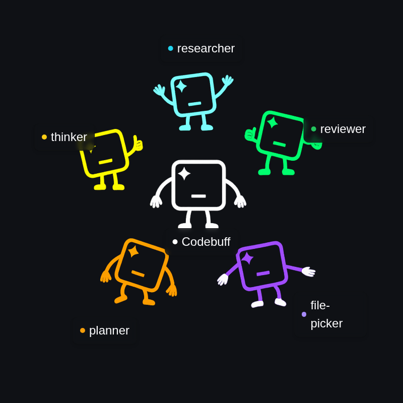

# Codebuff

Codebuff is an AI coding assistant that edits your codebase through natural language instructions. Instead of using one model for everything, it coordinates specialized agents that work together to understand your project and make precise changes.

Codebuff beats Claude Code 61% vs 53% on our internal evals across 200+ coding tasks over multiple open-source repos that simulate real-world tasks.


## How it works



When you ask Codebuff to "add authentication to my API," it doesn't just generate code and hope for the best. Instead:

1. A **File Explorer Agent** scans your codebase to understand the architecture and find relevant files
2. An **Planner Agent** plans which files need changes and in what order
3. An **Implementation Agents** make precise edits while **Review Agents** validate changes

This multi-agent approach gives you better context understanding, more accurate edits, and fewer errors compared to single-model tools.

## CLI: Install and start coding

```bash
npm install -g codebuff
cd your-project
codebuff
```

Codebuff analyzes your project structure, understands your patterns, and then you can ask it to:

- "Fix the SQL injection vulnerability in user registration"
- "Add rate limiting to all API endpoints"
- "Refactor the database connection code for better performance"

It finds the right files, makes consistent changes across your codebase, and runs tests to ensure nothing breaks.

## Create custom agents

You can create specialized agents for your workflows using TypeScript generators for more programmatic control:

```typescript
export default {
  name: 'security-auditor',
  model: 'claude-3-5-sonnet',
  spawnableAgents: ['file-explorer', 'vulnerability-scanner'],

  async *handleSteps() {
    yield { tool: 'code_search', pattern: 'eval\\(|innerHTML' }
    yield 'STEP' // Let AI analyze findings

    if (vulnerabilitiesFound) {
      yield 'STEP_ALL' // Let AI implement fixes
    }
  },
}
```

## SDK: Build custom AI coding tools

```typescript
import { CodebuffClient } from 'codebuff'

const client = new CodebuffClient({
  apiKey: 'your-api-key',
  projectRoot: '/path/to/your/project',
})

const result = await client.run({
  prompt: 'Optimize database queries in the user service',
  agent: 'performance-optimizer',
})
```

## What developers say

"It makes our agent way smarter and better" - Victor, Vly.ai (YC F24)

"Captured exactly how my agentic flows were set up and provides tooling for all of the hard parts" - Danny Hsu, Aspects Studio (YC F24)

## Why choose Codebuff

**Any model on OpenRouter**: Unlike Claude Code which locks you into Anthropic's models, Codebuff supports any model available on OpenRouter - from Claude and GPT to specialized models like Qwen, DeepSeek, and others. Switch models for different tasks or use the latest releases without waiting for platform updates.

**Deep customizability**: Create sophisticated agent workflows with TypeScript generators that mix AI generation with programmatic control. Define custom agents that spawn subagents, implement conditional logic, and orchestrate complex multi-step processes that adapt to your specific use cases.

**Fully customizable SDK**: Build Codebuff's capabilities directly into your applications with a complete TypeScript SDK. Create custom tools, integrate with your CI/CD pipeline, build AI-powered development environments, or embed intelligent coding assistance into your products.

## Get started

### Install

**CLI**: `npm install -g codebuff`  
**SDK**: `npm install codebuff`

### Resources

**Local development**: [local-development.md](./local-development.md)  
**Documentation**: [codebuff.com/docs](https://codebuff.com/docs)  
**Community**: [Discord](https://codebuff.com/discord)

### Enterprise

**Contact**: [enterprise@codebuff.com](mailto:enterprise@codebuff.com)
