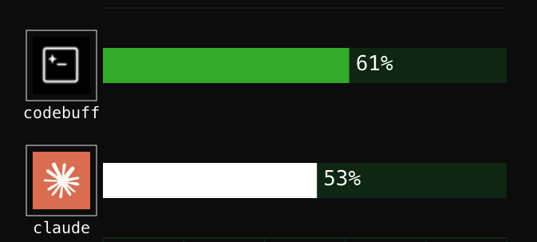
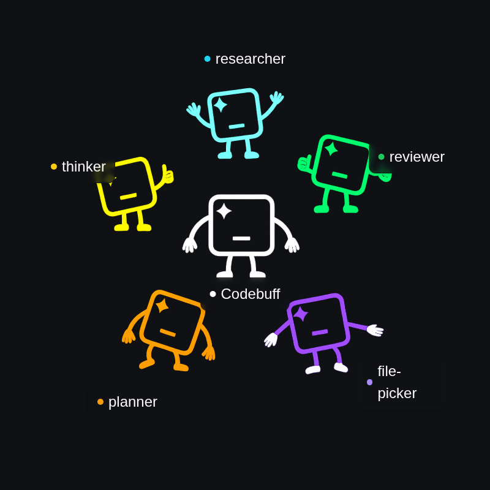

# Openbuff

English | [简体中文](./README.zh-CN.md)

**Openbuff** is an independent, local-first fork of Codebuff: an open-source agentic coding CLI that edits your codebase through natural language instructions using your configured OpenAI-compatible providers. It is focused entirely on a Bring Your Own Key (BYOK) model with no backend fallback, credits, or subscriptions.

Instead of using one model for everything, Openbuff coordinates specialized agents that work together to understand your project and make precise changes.

> **Fork & compatibility note:** Openbuff is an independent, local-first fork of Codebuff focused entirely on a Bring Your Own Key (BYOK) model with no backend fallback, credits, or subscriptions. You provide your own keys for user-configured providers. During the transition, some Codebuff names — package names like `@codebuff/sdk`, CLI flags like `codebuff --local`, environment variable prefixes like `CODEBUFF_*`, and config paths like `codebuff.json` — remain as fully supported legacy compatibility aliases. See [Openbuff Local/BYOK Provider Mode](./docs/local-mode.md) for provider setup using `openbuff.json`, `/provider add`, `/setup`, and `OPENBUFF_*` environment variables.

<div align="center">
  
</div>

Codebuff beats Claude Code at 61% vs 53% on [our evals](evals/README.md) across 175+ coding tasks over multiple open-source repos that simulate real-world tasks.


## How it works

When you ask Openbuff to "add authentication to my API," it might invoke:

1. A **File Picker Agent** to scan your codebase to understand the architecture and find relevant files
2. A **Planner Agent** to plan which files need changes and in what order
3. An **Editor Agent** to make precise edits
4. A **Reviewer Agent** to validate changes

<div align="center">
  
</div>

This multi-agent approach gives you better context understanding, more accurate edits, and fewer errors compared to single-model tools.

## CLI: Install and start coding

Install:

```bash
npm install -g openbuff
```

Run:

```bash
cd your-project
openbuff
```

Then just tell Openbuff what you want and it handles the rest:

- "Fix the SQL injection vulnerability in user registration"
- "Add rate limiting to all API endpoints"
- "Refactor the database connection code for better performance"

Openbuff will find the right files, make changes across your codebase, and run tests to make sure nothing breaks.

## Create custom agents

To get started building your own agents, start Openbuff and run the `/init` command:

```bash
openbuff
```

Then inside the CLI:

```
/init
```

This creates:
```
knowledge.md               # Project context for Openbuff
.agents/
└── types/                 # TypeScript type definitions
    ├── agent-definition.ts
    ├── tools.ts
    └── util-types.ts
```

You can write agent definition files that give you maximum control over agent behavior.

Implement your workflows by specifying tools, which agents can be spawned, and prompts. We even have TypeScript generators for more programmatic control.

For example, here's a `git-committer` agent that creates git commits based on the current git state. Notice that it runs `git diff` and `git log` to analyze changes, but then hands control over to the LLM to craft a meaningful commit message and perform the actual commit.

```typescript
export default {
  id: 'git-committer',
  displayName: 'Git Committer',
  model: 'openai/gpt-5.4-nano',
  toolNames: ['read_files', 'run_terminal_command', 'end_turn'],

  instructionsPrompt:
    'You create meaningful git commits by analyzing changes, reading relevant files for context, and crafting clear commit messages that explain the "why" behind changes.',

  async *handleSteps() {
    // Analyze what changed
    yield { tool: 'run_terminal_command', command: 'git diff' }
    yield { tool: 'run_terminal_command', command: 'git log --oneline -5' }

    // Stage files and create commit with good message
    yield 'STEP_ALL'
  },
}
```

## SDK: Run agents in production

Install the [SDK package](https://www.npmjs.com/package/@codebuff/sdk). The npm package name remains `@codebuff/sdk` for backward compatibility; it works with both Openbuff and Codebuff clients.

```bash
npm install @codebuff/sdk
```

Import the client and run agents!

```typescript
import { CodebuffClient } from '@codebuff/sdk'

// 1. Initialize the client
const client = new CodebuffClient({
  cwd: '/path/to/your/project',
  onError: (error) => console.error('Openbuff error:', error.message),
})

// 2. Do a coding task...
const result = await client.run({
  agent: 'base', // Openbuff's base coding agent
  prompt: 'Add error handling to all API endpoints',
  handleEvent: (event) => {
    console.log('Progress', event)
  },
})

// 3. Or, run a custom agent!
const myCustomAgent: AgentDefinition = {
  id: 'greeter',
  displayName: 'Greeter',
  model: 'openai/gpt-5.5',
  instructionsPrompt: 'Say hello!',
}
await client.run({
  agent: 'greeter',
  agentDefinitions: [myCustomAgent],
  prompt: 'My name is Bob.',
  customToolDefinitions: [], // Add custom tools too!
  handleEvent: (event) => {
    console.log('Progress', event)
  },
})
```

Learn more about the SDK [here](https://www.npmjs.com/package/@codebuff/sdk).

## Provider configuration

Openbuff runs local/BYOK by default: no Codebuff cloud auth, credits, or hosted
inference. Configure OpenAI-compatible providers and per-agent model routing in
`openbuff.json`. See [Openbuff Local/BYOK Provider Mode](./docs/local-mode.md).

Inside the CLI:

```text
/setup opencode-go   # or openai, codex, openrouter, ollama, glm
/provider add        # interactive provider wizard, including custom providers
/provider connect codex
/provider           # show loaded config, provider URLs, missing env vars
/models             # show default/lite/max/plan routing
/models configure   # interactive model routing wizard
/models set editor-proposal 2 opencode-go/glm-5.1
```

From the shell:

```bash
export OPENCODE_GO_API_KEY="your_key"
bun run smoke:openbuff
```

## Freebuff: The free coding agent

Don't want a subscription? **[Freebuff](https://www.npmjs.com/package/freebuff)** is a free variant of Codebuff — no subscription, no credits, no configuration. Just install and start coding.

```bash
npm install -g freebuff
cd your-project
freebuff
```

Freebuff is ad-supported and uses models optimized for fast, high-quality assistance. It includes built-in web research, browser use, and more. Learn more in the [Freebuff README](./freebuff/README.md).

## Why choose Openbuff

**Custom workflows**: TypeScript generators let you mix AI generation with programmatic control. Agents can spawn subagents, branch on conditions, and run multi-step processes.

**Provider-flexible**: Unlike single-provider tools, Openbuff can route each agent to any configured provider: OpenAI API, ChatGPT/Codex subscription OAuth, OpenRouter, opencode gateways, GLM/Z.ai, local Ollama/LM Studio, or another OpenAI-compatible endpoint.

**Reuse local agents**: Compose bundled and project-local `.agents/` without depending on the hosted Codebuff registry.

**SDK**: Build Openbuff into your applications. Create custom tools, integrate with CI/CD, or embed coding assistance into your products.

## Advanced Usage

### Custom Agent Workflows

Create your own agents with specialized workflows using the `/init` command:

```bash
openbuff
/init
```

This creates a custom agent structure in `.agents/` that you can customize.

## Contributing to Openbuff

We ❤️ contributions from the community - whether you're fixing bugs, tweaking our agents, or improving documentation.

**Want to contribute?** Check out our [Contributing Guide](./CONTRIBUTING.md) to get started.

### Running Tests

To run the test suite:

```bash
cd cli
bun test
```

**For interactive E2E testing**, install tmux:

```bash
# macOS
brew install tmux

# Ubuntu/Debian
sudo apt-get install tmux

# Windows (via WSL)
wsl --install
sudo apt-get install tmux
```

See [cli/src/__tests__/README.md](cli/src/__tests__/README.md) for comprehensive testing documentation.

Some ways you can help:

- 🐛 **Fix bugs** or add features
- 🤖 **Create specialized agents** and share reusable local templates
- 📚 **Improve documentation** or write tutorials
- 💡 **Share ideas** in our [GitHub Issues](https://github.com/CodebuffAI/codebuff/issues)

## Get started

### Install

**CLI**: `npm install -g openbuff`

**SDK**: `npm install @codebuff/sdk`

**Freebuff (free)**: `npm install -g freebuff`

### Resources

**Documentation**: See the [docs/](./docs) directory and [AGENTS.md](./AGENTS.md) for project docs.

**Community & Support**: [GitHub Issues](https://github.com/CodebuffAI/codebuff/issues)

**Contributing**: [CONTRIBUTING.md](./CONTRIBUTING.md) - Start here to contribute!

## Star History

[](https://www.star-history.com/#CodebuffAI/codebuff&Date)
