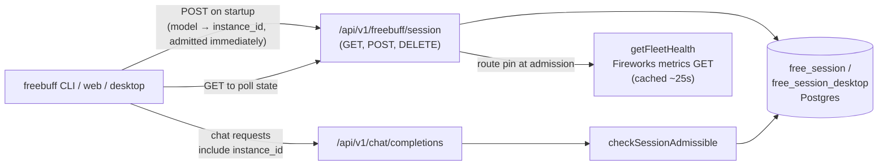
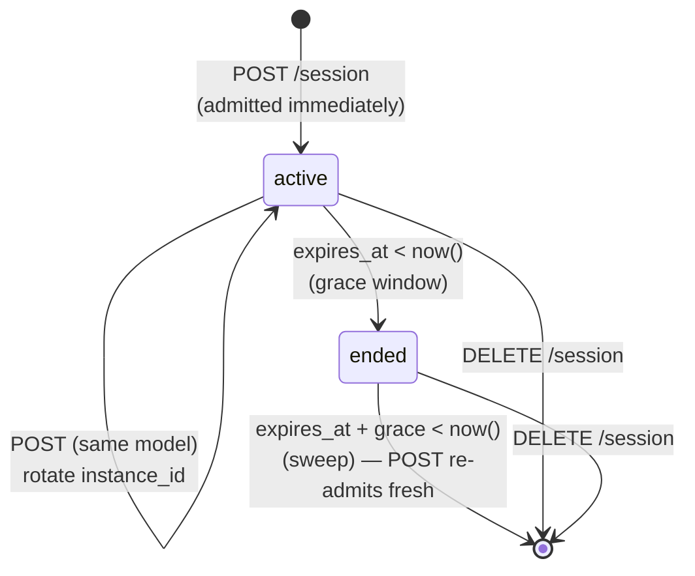

# Freebuff Session Admission

## Overview

The free-session layer manages **free-mode** access to the freebuff models. Every session request is **admitted immediately** — there is no waiting room, FIFO queue, capacity cap, or background admission ticker. The layer's jobs are:

1. **Fixed-length sessions bound to a model** — a session (default 1h, `FREEBUFF_SESSION_LENGTH_MS`) is created on `POST /api/v1/freebuff/session` and locked to the model it was admitted on; chat completions must use that model for the session's life.
2. **Session quotas** — premium models draw from a shared daily session pool; the limited access tier has its own daily pool; GLM 5.2 has a weekly referral-earned pool. Quota is checked *before* admission, so exhausted users get `rate_limited` instead of a session.
3. **One instance per account** (CLI/web) — prevent a single user from running N concurrent freebuff CLIs for N× throughput. Freebuff Desktop uses a separate multi-session table with its own caps.
4. **Health-based sticky Fireworks routing** — sessions on backup-capable models are pinned at admission to either the dedicated deployment or the serverless API, based on deployment health and measured TTFT.
5. **Country/privacy tiering** — the POST/GET handlers resolve the caller's country and IP-privacy classification into an access tier (`full` vs `limited`), or a hard block. The decision logic lives in `web/src/server/free-mode-country*` (see also `docs/freebuff-abuse-detection.md`).

> **History.** This layer used to be a *waiting room*: per-model FIFO queues, a 15s admission ticker with per-model advisory locks, estimated wait times, and a `FREEBUFF_WAITING_ROOM_ENABLED` kill switch. All of that has been removed — sessions are now admitted synchronously inside the POST request. A few legacy names survive on the wire and in the schema; see [Legacy naming](#legacy-naming).

## Architecture

### Components

- **`free_session` table** (Postgres) — single source of truth for CLI/web session state. One row per user (PK on `user_id`), locked to a `model`. See `packages/internal/src/db/schema.ts` for the authoritative column list.
- **`free_session_desktop` table** — Freebuff Desktop multi-session sibling, keyed by `(user_id, active_instance_id)` so one user holds one row per tab. See [Desktop multi-session](#desktop-multi-session).
- **`free_session_admit` table** — one row per fresh admission, carrying `model`, `access_tier`, and fractional `session_units`. This is the quota ledger: pools count admit rows since the current period's reset.
- **Model registry** (`common/src/constants/freebuff-models.ts`) — selector lists per tier, premium-model classification, availability hours, and the tier→model resolution helpers.
- **Public API** (`web/src/server/free-session/public-api.ts`) — `requestSession`, `getSessionState`, `endUserSession`, `checkSessionAdmissible`, `pinFreeSessionToMinimax`. Pure business logic behind a `SessionDeps` DI interface.
- **Store** (`web/src/server/free-session/store.ts`) — all DB ops: the `joinOrTakeOver` upsert, `promoteQueuedUser` admission transaction, expiry sweep, quota reads, and the desktop-session siblings.
- **Session view** (`web/src/server/free-session/session-view.ts`) — pure row→wire-shape mapping (`active` / `ended` / null).
- **Fleet health probe** (`web/src/server/free-session/fireworks-health.ts`) — `getFleetHealth()` classifies each dedicated Fireworks deployment as `healthy | degraded | unhealthy` from the Fireworks metrics endpoint, cached ~25s per pod; `routeForAdmission` combines it with measured TTFT to pick the session's upstream pin.
- **Expiry sweep** (`web/src/server/free-session/admission.ts`) — despite the filename, this no longer contains an admission loop. It holds `maybeSweepExpired`, the traffic-driven, throttled cleanup of rows past their grace window.
- **HTTP routes** (`web/src/app/api/v1/freebuff/session/`) — auth, country/privacy gate, header parsing, and status-code mapping; delegate to the public API.
- **Chat-completions gate** (`web/src/app/api/v1/chat/completions/_post.ts`) — for free-mode requests, calls `checkSessionAdmissible` and rejects non-admissible requests with a structured error. The session's `model` and sticky upstream pins are what get enforced/forwarded upstream.

## Admission Flow (`POST /session`)

`requestSession` runs, in order:

1. **Banned check** — banned accounts get `{ status: 'banned' }` before any row is created. (The HTTP layer has already resolved country/privacy and hard-blocked or tier-limited the caller.)
2. **Opportunistic expiry sweep** — fire-and-forget `maybeSweepExpired()` (see [Expiry sweep](#expiry-sweep)).
3. **Tier compatibility** — an existing row that the caller's current access tier can no longer use (e.g. a full-tier session after the user was reclassified as limited) is ended so it can't leak capacity.
4. **Reclaim detection** — if the caller already holds an active+unexpired row on the *same model and tier*, this POST is a takeover/reclaim (CLI restart), not a new session: skip the availability and quota gates, rotate `active_instance_id`, and keep the existing window and upstream pins. This is what makes a CLI restart mid-session free — quota only charges fresh admissions.
5. **Model availability** — models outside their deployment hours are rejected with `model_unavailable`.
6. **Quota gate** — resolve the model's session pool (see [Session quotas](#session-quotas)) and reject with `rate_limited` when it's exhausted.
7. **`joinOrTakeOver`** (store) — one race-safe UPSERT on the `user_id` PK encoding every case: no row → insert as transient `queued`; active+unexpired same model → rotate instance id only; active+unexpired different model → throw `FreeSessionModelLockedError` (→ `model_locked`, 409, without rotating the instance id so the other CLI stays valid); expired or queued row → reset to `queued` with the requested model.
8. **Immediate promotion** — if the row came back `queued`, `promoteQueuedUser` flips it to `active` in one transaction: `UPDATE ... WHERE status='queued' AND model=$model` sets `admitted_at`, `expires_at = now + sessionLength`, and the Fireworks route pin, and inserts the `free_session_admit` accounting row. Referral-v2 activation is recorded best-effort after commit. The `queued` status therefore only ever exists *within* a single request; it is never returned on the wire (the session view maps a queued row to null).
9. **Race recovery** — if the model-scoped promote matched nothing (a concurrent same-account request switched the model between the upsert and the promote), re-read the row and either use the now-active row or promote whatever queued row exists. The request never 500s on this race; a later GET poll self-heals any residual transient state.

Fresh admissions also emit two observability logs: `freebuff_fireworks_route` (the upstream pin, for backup-capable models) and `freebuff_ip_session_cap` (log-only per-IP concurrency instrumentation — see `docs/freebuff-abuse-detection.md`).

## Database Schema

`packages/internal/src/db/schema.ts` is the source of truth (`freeSession`, `freeSessionDesktop`, `freeSessionAdmit`). Highlights of `free_session`:

- **PK on `user_id`** — structural enforcement of "one CLI/web session per account"; no app-logic race can produce two rows.
- **`status`** — enum `('queued', 'active')`. `queued` is transient within a single POST (step 8 above); a persisted row is effectively always `active`.
- **`active_instance_id`** — rotates on every non-locked POST; how one-CLI-at-a-time is enforced (see [Single-instance enforcement](#single-instance-enforcement)).
- **`model` + `access_tier`** — fixed for the life of an active session; switching requires DELETE + re-POST (`model_locked` otherwise).
- **`fireworks_route`** — sticky upstream pin (`deployment` | `serverless`), decided once at admission, null for models without a serverless backup.
- **`minimax_upstream`** — reactive sticky pin to the official MiniMax API, set the first time Fireworks rate-limits the session (see `pinFreeSessionToMinimax`).
- **Country/privacy columns** — resolved country, Cloudflare header, GeoIP fallback, privacy signals, and a keyed hash of the client IP (raw IPs are not stored).
- **All timestamps server-supplied** — the client never sends `queued_at`, `admitted_at`, or `expires_at`.
- **FK CASCADE on user delete** keeps the table clean without a background job.

`free_session_admit` is written once per fresh admission and is the quota ledger. `session_units` starts at 1.0 and is revised down to a fractional value (rounded up to 0.1) when the user ends the session early via DELETE — so ending a premium session after 10 minutes only charges 0.2 units against the daily pool.

## Session Lifecycle

`ended` is not a stored status — it is derived from `expires_at` versus `now()`:

- `expires_at > now()` → `active` (gate: `ok: 'active'`)
- `expires_at <= now() < expires_at + grace` → `ended` on the wire; gate still admits with `ok: 'draining'` (see [Drain / grace window](#drain--grace-window))
- `expires_at + grace <= now()` → expired: the gate returns `session_expired`, GET returns `none` (after sweep), and a POST admits a brand-new session

## Single-instance Enforcement

The challenge: a user running two CLIs on the same account should not get 2× throughput.

The PK on `user_id` gives us one session row per user, but both CLIs could share that row and double up their request rate. The solution is `active_instance_id`:

1. On startup, the CLI calls `POST /session`. The server generates a fresh UUID, stores it, and returns it.
2. Every subsequent chat request includes that id in `codebuff_metadata.freebuff_instance_id`.
3. `checkSessionAdmissible` rejects the request with `session_superseded` (HTTP 409) if the claimed id doesn't match the stored one.
4. When the user starts a second CLI, its POST rotates `active_instance_id`. The first CLI's next request hits 409, so only the latest CLI can make chat requests.

The rotation happening even for an already-active row is what makes a second CLI always win — first-wins or a take-over-force-flag would let an attacker keep the old CLI alive forever.

**What this does NOT prevent:** manually syncing `instance_id` between two CLIs (high-friction, accepted), and multi-account abuse (covered by the country/privacy gate, GitHub-age gates, and the abuse-detection tooling).

## Desktop Multi-session

Freebuff Desktop sends the multi-session header, which routes to `free_session_desktop`: one row per tab, keyed by `(user_id, active_instance_id)` with a client-supplied stable per-tab instance id. Desktop rows never supersede each other. The caps are:

- **Premium-bucket slot (one per user)** — enforced as a DB invariant by the partial unique index `uniq_free_session_desktop_premium_active`. Premium-bucket = premium models + MiniMax M3 + GLM 5.2 on the full tier, and *every* model on the limited tier (limited = one freebuff tab, period). A racing second admit maps the unique violation to `premium_slot_taken`; if the current holder is dead (past expiry + grace), the admission path evicts it and retries once.
- **Total concurrent-session backstop** — `FREEBUFF_DESKTOP_MAX_CONCURRENT_SESSIONS` (8) live rows per user, counting draining rows; rejected as `rate_limited` with `reason: 'concurrent_sessions'`.

Reclaims (existing row for the same tab) refresh the session window in place without writing a new admit row, so lazy per-turn re-admits never double-count the quota.

## Health-based Sticky Routing

For any model with a Fireworks serverless backup (`FIREWORKS_SERVERLESS_FALLBACK_MODELS` in `web/src/llm-api/fireworks-config.ts`, e.g. `minimax/minimax-m3`), the serverless API is an always-on relief valve: instead of throttling admission when the dedicated deployment heats up, we **admit everyone and route per session**.

At admission, `routeForAdmission(model, fleet, ttftP90Ms?)` (in `fireworks-health.ts`) reads the deployment's current health plus its recent measured TTFT and pins the session to one of two upstreams, stored on `free_session.fireworks_route`:

- `deployment` — deployment was `healthy` at admission **and** recent TTFT p90 ≤ `TTFT_SERVERLESS_THRESHOLD_MS` → the fast, prompt-cached dedicated deployment.
- `serverless` — deployment was `degraded`/`unhealthy`, **or** recent TTFT p90 over the threshold → the Fireworks serverless API.

### Two health signals: Prometheus + measured TTFT

1. **Fireworks Prometheus metrics** (`getFleetHealth` → `classifyOne`, cached ~25s per pod): KV-cache saturation, 5xx rate, and prefill-queue p90. The always-available, all-pods-converge backstop. Fails *closed* (→ unhealthy) on probe error / missing key / stale snapshot.
2. **Our measured TTFT** (`web/src/llm-api/fireworks-ttft.ts`): true end-to-end TTFT recorded on every streamed request the dedicated deployment actually served, feeding a per-pod rolling p90 (`TTFT_WINDOW_MS` = 2 min, min `TTFT_MIN_SAMPLES` = 10). When that p90 exceeds `TTFT_SERVERLESS_THRESHOLD_MS` (currently 4s), new sessions divert to serverless *even while the Prometheus counters still read `healthy`* — TTFT degrades in real user experience before KV/error counters move.

The TTFT signal is per-pod in-memory and **self-correcting**: sessions already pinned to the deployment stay there (sticky) and keep recording TTFT, so as the deployment cools their p90 falls back under the threshold and new sessions flow back. With too few recent samples the p90 is `undefined` (no TTFT-based trip) — fine, because the deployment isn't stressed at low volume, and the Prometheus signal still applies.

The pin is **decided once and frozen for the session's life**. Takeover/reclaim never recomputes it, so a session never flaps between upstreams — flapping would cold-start its prompt cache on every switch. As the deployment heats up, each *new* session is shed onto serverless while already-admitted sessions keep their warm deployment cache; when it recovers, new sessions flow back.

The chat hot path (`_post.ts`) reads the pin off the gate result (`SessionGateResult.fireworksRoute`) and forwards it to the Fireworks handlers as `useCustomDeployment` (`serverless` → `false`). The per-request deployment→serverless error fallback in `createFireworksRequestWithFallback` remains as a last-resort safety net for hard 5xx/throws, but the *steady-state* routing decision is the per-session pin. Each pin is logged once (`metric: 'freebuff_fireworks_route'`) so the split is chartable in the freebuff Axiom dataset.

A second, **reactive** pin exists for MiniMax-family models: when the Fireworks serverless API rate-limits a session (429), the hot path calls `pinFreeSessionToMinimax`, which sets `free_session.minimax_upstream = 'minimax'` so every later request goes to the official MiniMax API — sticky for the same warm-cache reason.

## Session Quotas

Quota is enforced at POST time (fresh admissions only — reclaims are exempt) by counting `free_session_admit` rows since the current period's reset. Pools (`quotaConfigForModel` in `public-api.ts`; limits live in `common/src/constants/freebuff-models.ts`):

- **Premium pool** (full tier) — premium models share one daily session-unit pool, resetting at midnight Pacific.
- **Unlimited models** (full tier, non-premium) — no session quota at all; only the cross-model Redis free-mode request rate limiter applies.
- **Limited pool** (limited tier) — its own daily pool covering the limited-tier model set.
- **GLM 5.2 weekly pool** — the limit is dynamic: the caller's GLM referral entitlement (capped qualified referrals), resetting weekly. A 0 entitlement rejects as `rate_limited`.

Two bonuses raise a pool's limit for the current period: **streak rewards** (7-day-streak milestones grant bonus session units per pool, `docs/` + `freebuff_streak_reward` ledger) and, for the limited pool only, a **referral bonus** (+1 daily session per qualified limited-tier referral, capped). The active/ended responses carry `rateLimit` / `rateLimitsByModel` snapshots so clients can render "N of M sessions used" without extra round-trips.

## Expiry Sweep

There is no background ticker. Cleanup of rows past `expires_at + grace` is **traffic-driven**: every POST fires `maybeSweepExpired()` fire-and-forget, which is throttled to one sweep per `EXPIRY_SWEEP_THROTTLE_MS` (15s) per instance and guarded against overlap. It deletes dead rows from both `free_session` and `free_session_desktop`.

Because nothing gates on active-session counts anymore, an un-swept expired row has no functional impact — the sweep just keeps the tables from growing unbounded. Rows inside the grace window are deliberately kept so the completions gate can serve draining sessions.

## HTTP API

All endpoints authenticate via `Authorization: Bearer <api-key>` or `x-codebuff-api-key`. Request headers: the model via `X-Freebuff-Model` on POST, the held instance id via `X-Freebuff-Instance-Id`, and the desktop multi-session flag via its own header (constants in `freebuff-models.ts`). The wire shapes' source of truth is `common/src/types/freebuff-session.ts` (`FreebuffSessionServerResponse`).

### `POST /api/v1/freebuff/session`

Called by the CLI on startup and on model switch. Runs the [admission flow](#admission-flow-post-session) and returns:

- `active` (200) — the normal case: admitted immediately, with `instanceId`, `model`, `expiresAt`, `remainingMs`, and quota snapshots.
- `ended` (200) — the row is inside its grace window (only reachable via edge cases; a POST on an expired row normally re-admits fresh).
- `model_locked` (409) — active session bound to a different model; DELETE then re-POST to switch.
- `model_unavailable` (409) — model outside its deployment hours.
- `rate_limited` (429) — session pool exhausted (`retryAfterMs` until the next reset), or the desktop concurrent-session backstop (`reason: 'concurrent_sessions'`).
- `premium_slot_taken` (409) — desktop only: the single premium-bucket slot is held by another tab.
- `banned` (403), `country_blocked` (403) — terminal.

### `GET /api/v1/freebuff/session`

Read-only polling; never rotates `active_instance_id`. Returns `active` / `ended` with live quota snapshots, plus:

- `none` — no row (or swept past grace). Carries `rateLimitsByModel` and referral-banner info so the model picker can render usage before joining.
- `superseded` — an active row exists but the supplied `X-Freebuff-Instance-Id` no longer matches: another CLI on the account took over.

### `DELETE /api/v1/freebuff/session`

Ends the session immediately, finalizing the admit row's fractional `session_units` (early end = partial charge). Response: `{ "status": "ended" }`.

## Chat Completions Gate

For free-mode requests (`codebuff_metadata.cost_mode === 'free'`), `_post.ts` calls `checkSessionAdmissible(userId, claimedInstanceId, requestedModel, ...)` before the per-user rate limiter, so session rejections do not consume request quota.

### Response codes

| HTTP | `error`                  | When                                                                                                                                      |
| ---- | ------------------------ | ----------------------------------------------------------------------------------------------------------------------------------------- |
| 428  | `waiting_room_required`  | No session row exists, or the request carried no `freebuff_instance_id`. Client should POST /session.                                    |
| 429  | `waiting_room_queued`    | Row is in the transient `queued` state — only reachable in a microsecond race with a concurrent POST. Client retries via its normal poll. |
| 409  | `session_superseded`     | Claimed `instance_id` does not match the stored one — another CLI took over.                                                              |
| 409  | `session_model_mismatch` | The request's model doesn't match the session's bound model or access tier (stale tab / tier reclassification).                          |
| 410  | `session_expired`        | Past the hard cutoff (`expires_at + grace`). Client should POST /session to start a new session.                                          |

Successful results carry `reason: 'active'` (with `remainingMs`) or `reason: 'draining'` (with `gracePeriodRemainingMs`), plus the session's sticky `fireworksRoute` / `minimaxUpstream` pins for the upstream handlers. The model-mismatch check has one deliberate exception: smart freebuff models may spawn the gemini-thinker subagent, whose Gemini Pro requests are admitted against the parent's session row (`canFreebuffModelSpawnGeminiThinker`).

## Drain / Grace Window

We don't kill an agent mid-run just because the session ticked over. After `expires_at`, the row drains for `SESSION_GRACE_MS` (30 min):

- `checkSessionAdmissible` returns `{ ok: true, reason: 'draining', gracePeriodRemainingMs }` — chat completions still go through.
- `getSessionState` returns `{ status: 'ended', instanceId, ... }` on the wire. The CLI hides the input and shows the rejoin banner while still forwarding the instance id so in-flight agent work can keep streaming.
- The expiry sweep skips the row, keeping it in the DB so the gate keeps working.
- A fresh POST during the drain window admits a brand-new session immediately (the drained row counts as expired to `joinOrTakeOver`).

This is a **trust-the-client** design: the server still admits requests during the drain window and relies on the CLI to stop submitting new user prompts at `expires_at`. The 30-min hard cutoff caps the abuse surface — a client that ignores the contract extends a session by at most one grace window per expiry.

## CLI Integration (frontend-side contract)

The CLI:

1. **On startup**, calls `POST /session` with the user's persisted model choice and is admitted immediately. Stores `instanceId` in memory (not on disk — startup re-admits).
2. **While `status === 'active'`**, renders `remainingMs` as a countdown and re-polls GET periodically (with `X-Freebuff-Instance-Id`) to stay honest with server-side state.
3. **Model switch** → re-POSTs with the new model id. On `model_locked`, prompts the user to end the current session first (DELETE, then re-POST).
4. **When `status === 'ended'`** (draining, with `instanceId`), hides the input and shows the rejoin banner while still forwarding the instance id on outgoing chat requests so in-flight agent work can finish.
5. **When `status === 'superseded'`**, stops polling and shows the "close the other CLI" screen.
6. **On every chat request**, includes `codebuff_metadata.freebuff_instance_id`.
7. **Handles chat-gate errors** (409/410/428/429, see `FreebuffGateErrorKind` in `cli/src/utils/error-handling.ts`) for fast in-flight feedback without waiting for the next poll.
8. **On clean exit**, calls `DELETE /session` so early-ended sessions are only charged fractional units.

## Multi-pod Behavior

- **Session routes are stateless per pod**; all state lives in Postgres. Any pod serves any request. There is no cross-pod coordination to do — admission is a per-user row upsert + update, race-safe on the PK.
- **Chat completions gate** is a single PK `SELECT` per free-mode request.
- **Free-mode request rate limits** use Redis/Valkey when `REDIS_URL` is set (one atomic Lua script per fixed window); per-pod memory otherwise (dev/tests).
- **Expiry sweep** is throttled per instance (15s); overlapping sweeps across pods are harmless (idempotent DELETEs).
- **Fleet health / TTFT signals** are cached per pod (25s TTL keeps each pod under the Fireworks 6 req/min metrics rate limit; TTFT windows are per-pod in-memory by design).

## Legacy Naming

The waiting room is gone, but some of its names survive for wire/schema compatibility:

- **Gate error codes** `waiting_room_required` / `waiting_room_queued` — kept because deployed CLIs pattern-match them (`FreebuffGateErrorKind`). Semantically they now mean "no session" and "transient admission race".
- **`free_session.status` enum** still has `queued` — now only a transient intra-request state (see [Admission flow](#admission-flow-post-session)).
- **`queued_at` column and `idx_free_session_queue` index** — `queued_at` is effectively "row created/reset at".
- **Store/comment vocabulary** (`joinOrTakeOver`, `promoteQueuedUser`) reflects the join-then-promote shape the instant-admit path reuses.

## Tunables

| Constant                                    | Location                                   | Default    | Purpose                                                                                        |
| ------------------------------------------- | ------------------------------------------ | ---------- | ---------------------------------------------------------------------------------------------- |
| `FREEBUFF_SESSION_LENGTH_MS`                | env                                        | 3_600_000  | Session lifetime.                                                                              |
| `SESSION_GRACE_MS`                          | `web/src/server/free-session/config.ts`    | 1_800_000  | Drain window after expiry; hard cutoff at `expires_at + grace`.                                |
| `EXPIRY_SWEEP_THROTTLE_MS`                  | `config.ts`                                | 15_000     | Min interval between traffic-driven expiry sweeps, per instance.                               |
| `FREEBUFF_DESKTOP_MAX_CONCURRENT_SESSIONS`  | `config.ts`                                | 8          | Desktop per-user concurrent-tab backstop.                                                      |
| `FREEBUFF_IP_SESSION_CAP`                   | env                                        | —          | Candidate per-IP concurrent-session cap; **log-only** today (tags `wouldBlock`).               |
| `IP_SESSION_LOG_FLOOR`                      | `config.ts`                                | 5          | Min per-IP concurrency before the log line is emitted.                                         |
| `HEALTH_CACHE_TTL_MS`                       | `fireworks-health.ts`                      | 25_000     | Fleet probe cache TTL (under the Fireworks 30s exporter cadence / 6 req/min limit).            |
| `TTFT_SERVERLESS_THRESHOLD_MS`              | `web/src/llm-api/fireworks-ttft.ts`        | 4_000      | Measured-TTFT p90 above which new sessions pin to serverless.                                  |
| `TTFT_WINDOW_MS` / `TTFT_MIN_SAMPLES`       | `fireworks-ttft.ts`                        | 2 min / 10 | Rolling TTFT p90 window and minimum sample count.                                              |
| Session pool limits / periods               | `common/src/constants/freebuff-models.ts`  | —          | Premium/limited daily limits, GLM weekly pool, reset timezone, premium-model classification.   |
| `REDIS_URL`                                 | env                                        | unset      | Distributed free-mode request rate-limit counters; per-pod memory fallback when unset.         |

## Abuse Resistance Summary

This table covers the **session** attack surface. For finding and actioning accounts that script the free chat-completions endpoint directly (proxy/farm abuse, detection scripts, and the ban playbook), see [`freebuff-abuse-detection.md`](./freebuff-abuse-detection.md).

| Attack                                              | Mitigation                                                                                                                                       |
| ---------------------------------------------------- | -------------------------------------------------------------------------------------------------------------------------------------------------|
| CLI keeps submitting new prompts past `expires_at`  | Trusted client; bounded by the 30-min hard cutoff at `expires_at + grace`, after which the gate returns `session_expired`.                       |
| Multiple sessions per account (CLI/web)             | PK on `user_id` — structurally impossible.                                                                                                       |
| Multiple CLIs sharing one session                   | `active_instance_id` rotates on POST; stale id → 409.                                                                                            |
| Unlimited session churn on premium models           | Fresh admissions write `free_session_admit` rows; the daily/weekly pools gate the next POST. Early end only refunds via fractional units.        |
| Client-forged timestamps                            | All timestamps server-supplied.                                                                                                                  |
| Concurrent POSTs for one user                       | Single UPSERT on the PK; the promote is a conditional UPDATE with in-request race recovery.                                                      |
| Desktop tab fan-out                                 | Premium-bucket partial unique index (one slot) + 8-session backstop counting draining rows.                                                      |
| Registration farms sharing one egress IP            | Log-only per-IP concurrency instrumentation today (`freebuff_ip_session_cap`); enforcement pending once the shared-NAT ceiling is measured.      |
| VPN / proxy / hosting / Tor egress                  | Country/privacy gate at POST/GET: hard block or limited tier (see `free-mode-country*` and the privacy decision engine).                          |

## Testing

Pure logic covered by `web/src/server/free-session/__tests__/*.test.ts`:

- `public-api.test.ts` — all admission/status transitions via in-memory DI store (immediate admit, reclaim, `model_locked`, quota gates, desktop multi-session)
- `session-view.test.ts` — row→response mapping, including the transient-queued→null rule
- `admission.test.ts` — opportunistic sweep throttling/overlap behavior
- `fireworks-health.test.ts` — `classifyOne` decision table and `routeForAdmission`
- `config.test.ts` — config accessors

Handler tests in `web/src/app/api/v1/freebuff/session/__tests__/` cover auth + request routing with a mocked `SessionDeps`. The real store (`store.ts`) is thin glue over Postgres and is validated at the integration/e2e level.

## Known Gaps / Future Work

- **No rate limit on `/session` itself.** POST/GET spam is bounded only by upstream per-IP limits. GET polls are high-volume (~100k/hr) and logged only when slow (`freebuff_session_timing`).
- **Per-IP session cap is log-only.** Enforcement pending reading the logged `activeForIp` distribution (see `docs/freebuff-abuse-detection.md`).
- **No admin UI.** Inspecting active sessions or kicking a user requires DB access.
- **Session length is global.** Per-user or per-tier session length would need a column on the row.
