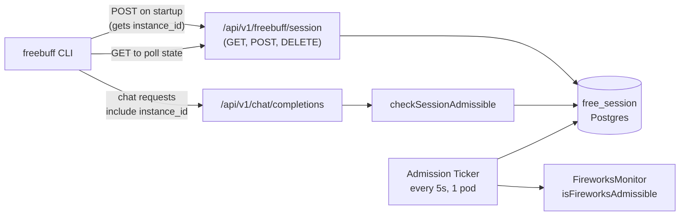
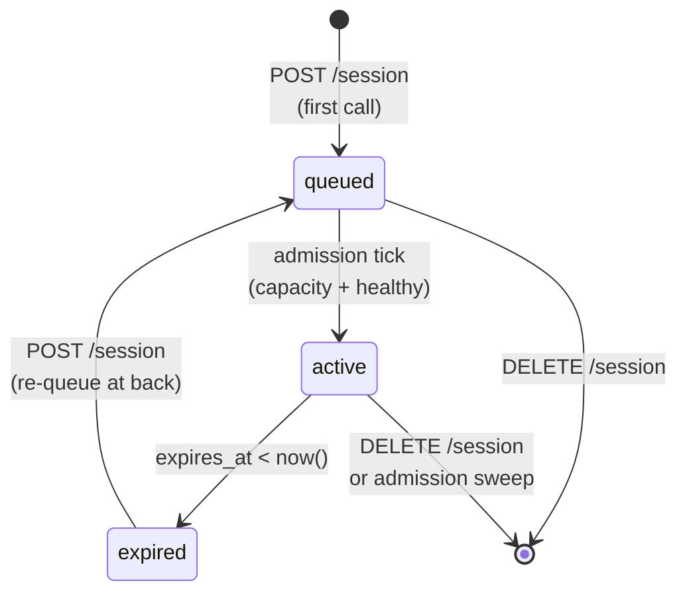

# Freebuff Waiting Room

## Overview

The waiting room is the admission control layer for **free-mode** requests against the freebuff Fireworks deployment. It has three jobs:

1. **Bound concurrency** — cap the number of simultaneously-active free users so one deployment does not degrade under load.
2. **Gate on upstream health** — only admit new users while the Fireworks deployment is reporting `healthy` (via the separate monitor in `web/src/server/fireworks-monitor/`).
3. **One instance per account** — prevent a single user from running N concurrent freebuff CLIs to get N× throughput.

Users who cannot be admitted immediately are placed in a FIFO queue and given an estimated wait time. Admitted users get a fixed-length session (default 1h) during which they can make free-mode requests subject to the existing per-user rate limits.

The entire system is gated by the env flag `FREEBUFF_WAITING_ROOM_ENABLED`. When `false`, the gate is a no-op and the admission ticker does not start; free-mode traffic flows through unchanged.

## Kill Switch

```bash
# Disable entirely (both the gate on chat/completions and the admission loop)
FREEBUFF_WAITING_ROOM_ENABLED=false

# Other knobs (only read when enabled)
FREEBUFF_SESSION_LENGTH_MS=3600000         # 1 hour
FREEBUFF_MAX_CONCURRENT_SESSIONS=50
```

Flipping the flag is safe at runtime: existing rows stay in the DB and will be admitted / expired correctly whenever the flag is flipped back on.

## Architecture



### Components

- **`free_session` table** (Postgres) — single source of truth for queue + active-session state. One row per user (PK on `user_id`).
- **Public API** (`web/src/server/free-session/public-api.ts`) — `requestSession`, `getSessionState`, `endUserSession`, `checkSessionAdmissible`. Pure business logic; DI-friendly.
- **Store** (`web/src/server/free-session/store.ts`) — all DB ops. Transaction boundaries and advisory locks live here.
- **Admission ticker** (`web/src/server/free-session/admission.ts`) — self-scheduling timer that runs every 5s, sweeps expired rows, and admits queued users up to capacity.
- **HTTP routes** (`web/src/app/api/v1/freebuff/session/`) — thin wrappers that resolve the API key → `userId` and delegate to the public API.
- **Chat-completions gate** (`web/src/app/api/v1/chat/completions/_post.ts`) — for free-mode requests, calls `checkSessionAdmissible(userId, claimedInstanceId)` after the rate-limit check and rejects non-admissible requests with a structured error.

## Database Schema

```sql
CREATE TYPE free_session_status AS ENUM ('queued', 'active');

CREATE TABLE free_session (
  user_id             text PRIMARY KEY REFERENCES "user"(id) ON DELETE CASCADE,
  status              free_session_status NOT NULL,
  active_instance_id  text NOT NULL,
  queued_at           timestamptz NOT NULL DEFAULT now(),
  admitted_at         timestamptz,
  expires_at          timestamptz,
  created_at          timestamptz NOT NULL DEFAULT now(),
  updated_at          timestamptz NOT NULL DEFAULT now()
);

CREATE INDEX idx_free_session_queue  ON free_session (status, queued_at);
CREATE INDEX idx_free_session_expiry ON free_session (expires_at);
```

Migration: `packages/internal/src/db/migrations/0043_vengeful_boomer.sql`.

**Design notes**

- **PK on `user_id`** is the structural enforcement of "one session per account". No app-logic race can produce two rows for one user.
- **`active_instance_id`** rotates on every `POST /session` call. This is how we enforce one-CLI-at-a-time (see [Single-instance enforcement](#single-instance-enforcement)).
- **All timestamps server-supplied.** The client never sends `queued_at`, `admitted_at`, or `expires_at` — they are either `DEFAULT now()` or computed server-side during admission.
- **FK CASCADE on user delete** keeps the table clean without a background job.

## State Machine



There is no stored `expired` status. An `active` row whose `expires_at` is in the past is treated as expired by `checkSessionAdmissible` and swept by the admission ticker.

## Single-instance Enforcement

The challenge: a user running two CLIs on the same account should not get 2× throughput.

The PK on `user_id` gives us one session row per user, but both CLIs could share that row and double up their request rate (bounded only by the per-user rate limiter, which isn't ideal).

The solution: `active_instance_id`.

1. On startup, the CLI calls `POST /api/v1/freebuff/session`. The server generates a fresh UUID (`active_instance_id`), stores it, and returns it.
2. Every subsequent chat request includes that id in `codebuff_metadata.freebuff_instance_id`.
3. `checkSessionAdmissible` rejects the request with `session_superseded` (HTTP 409) if the claimed id doesn't match the stored one.
4. When the user starts a second CLI, it calls `POST /session`, which rotates `active_instance_id`. The first CLI's subsequent request hits 409, so only the latest CLI can actually make chat requests.

The rotation is important: it happens even if the caller is already in the `active` state, so a second CLI always wins. Any other design (first-wins, take-over-requires-force-flag) would allow the attacker to keep the old CLI alive forever.

### What this does NOT prevent

- A single user manually syncing `instance_id` between two CLIs (e.g. editing a config file). This is possible but requires them to re-sync after every startup call, so it's high-friction. We accept this.
- A user creating multiple accounts. That is covered by other gates (MIN_ACCOUNT_AGE_FOR_PAID_MS, geo check) and the Fireworks monitor's overall throttle.

## Admission Loop

One pod runs the admission loop at a time, coordinated via Postgres advisory lock. All pods start a ticker on boot, but each tick acquires `pg_try_advisory_xact_lock(FREEBUFF_ADMISSION_LOCK_ID)` inside a transaction; if already held, the tick is a no-op on that pod. The lock is automatically released when the transaction commits.

Each tick does (in order):

1. **Sweep expired.** `DELETE FROM free_session WHERE status='active' AND expires_at < now()`. Runs regardless of upstream health so zombie sessions are cleaned up even during an outage.
2. **Check upstream health.** `isFireworksAdmissible()` from the monitor. If not `healthy`, skip admission for this tick (queue grows; users see `status: 'queued'` with increasing position).
3. **Measure capacity.** `capacity = min(MAX_CONCURRENT - activeCount, MAX_ADMITS_PER_TICK)`. `MAX_ADMITS_PER_TICK=20` caps thundering-herd admission when a large block of sessions expires simultaneously.
4. **Admit.** `SELECT ... WHERE status='queued' ORDER BY queued_at, user_id LIMIT capacity FOR UPDATE SKIP LOCKED`, then `UPDATE` those rows to `status='active'` with `admitted_at=now()`, `expires_at=now()+sessionLength`.

### Tunables

| Constant | Location | Default | Purpose |
|---|---|---|---|
| `ADMISSION_TICK_MS` | `config.ts` | 5000 | How often the ticker fires |
| `MAX_ADMITS_PER_TICK` | `config.ts` | 20 | Upper bound on admits per tick |
| `FREEBUFF_SESSION_LENGTH_MS` | env | 3_600_000 | Session lifetime |
| `FREEBUFF_MAX_CONCURRENT_SESSIONS` | env | 50 | Global active-session cap |

## HTTP API

All endpoints authenticate via the standard `Authorization: Bearer <api-key>` or `x-codebuff-api-key` header.

### `POST /api/v1/freebuff/session`

**Called by the CLI on startup.** Idempotent. Semantics:

- No existing row → create with `status='queued'`, fresh `active_instance_id`, `queued_at=now()`.
- Existing queued row → rotate `active_instance_id`, preserve `queued_at` (no queue jump).
- Existing active+unexpired row → rotate `active_instance_id`, preserve `status`/`admitted_at`/`expires_at`.
- Existing active+expired row → reset to queued with fresh `queued_at` (re-queue at back).

Response shapes:

```jsonc
// Waiting room disabled — CLI should treat this as "always admitted"
{ "status": "disabled" }

// In queue
{
  "status": "queued",
  "instanceId": "e47…",
  "position": 17,          // 1-indexed
  "queueDepth": 43,
  "estimatedWaitMs": 3600000,
  "queuedAt": "2026-04-17T12:00:00Z"
}

// Admitted
{
  "status": "active",
  "instanceId": "e47…",
  "admittedAt": "2026-04-17T12:00:00Z",
  "expiresAt":  "2026-04-17T13:00:00Z",
  "remainingMs": 3600000
}
```

### `GET /api/v1/freebuff/session`

**Read-only polling.** Does not mutate `active_instance_id`. The CLI uses this to refresh the countdown / queue position. Returns the same shapes as POST, plus:

```jsonc
// User has no row at all — must call POST first
{ "status": "none", "message": "Call POST to join the waiting room." }
```

### `DELETE /api/v1/freebuff/session`

**End session immediately.** Deletes the row; the freed slot is picked up by the next admission tick.

Response: `{ "status": "ended" }`.

## Chat Completions Gate

For free-mode requests (`codebuff_metadata.cost_mode === 'free'`), `_post.ts` calls `checkSessionAdmissible` after the per-user rate limiter and before the subscriber block-grant check.

### Response codes

| HTTP | `error` | When |
|---|---|---|
| 428 | `waiting_room_required` | No session row exists. Client should call POST /session. |
| 429 | `waiting_room_queued` | Row exists with `status='queued'`. Client should keep polling GET. |
| 409 | `session_superseded` | Claimed `instance_id` does not match stored one — another CLI took over. |
| 410 | `session_expired` | Row exists with `status='active'` but `expires_at < now()`. Client should POST /session to re-queue. |

When the waiting room is disabled, the gate returns `{ ok: true, reason: 'disabled' }` without touching the DB.

## Estimated Wait Time

Computed in `session-view.ts` as an **upper bound** that assumes uniform session expiry:

```
waves      = floor((position - 1) / maxConcurrent)
waitMs     = waves * sessionLengthMs
```

- Position 1..`maxConcurrent` → 0 (next tick will admit them)
- Position `maxConcurrent`+1..`2*maxConcurrent` → one full session length
- and so on.

Actual wait is usually shorter because users call `DELETE /session` on CLI exit and sessions turn over naturally. We show an upper bound because under-promising on wait time is better UX than surprise delays.

## CLI Integration (frontend-side contract)

Not implemented yet. When the CLI is updated, it should:

1. **On startup**, call `POST /api/v1/freebuff/session`. Store `instanceId` in memory (not on disk — startup must re-admit).
2. **Loop while `status === 'queued'`:** poll `GET /api/v1/freebuff/session` every ~5s and render `position / queueDepth / estimatedWaitMs` to the user.
3. **When `status === 'active'`**, start rendering `remainingMs` as a countdown. Re-poll GET every ~30s to stay honest with server-side state.
4. **On every chat request**, include `codebuff_metadata.freebuff_instance_id: <stored id>`.
5. **Handle gate errors:**
   - `session_superseded` (409) → surface "another freebuff instance has taken over; exiting" and shut down.
   - `session_expired` (410) → go back to step 1 (re-admit into queue).
   - `waiting_room_queued` (429) → shouldn't happen under normal flow but recoverable by polling GET.
   - `waiting_room_required` (428) → shouldn't happen either; call POST.
6. **On clean exit**, call `DELETE /api/v1/freebuff/session` so the next user can be admitted sooner.

The `disabled` response means the server has the waiting room turned off. CLI should treat it identically to `active` with infinite remaining time — do not show a countdown, and include a dummy/empty `freebuff_instance_id` (the server ignores it).

## Multi-pod Behavior

- **`/api/v1/freebuff/session` routes** are stateless per pod; all state lives in Postgres. Any pod can serve any request.
- **Chat completions gate** is a single `SELECT` per free-mode request. At high QPS this is the hottest path — the `user_id` PK lookup is O(1). If it ever becomes a problem, the obvious fix is to cache the session row for ~1s per pod.
- **Admission loop** runs on every pod but is serialized by `pg_try_advisory_xact_lock`. At any given tick, exactly one pod actually admits; the rest early-return.

## Abuse Resistance Summary

| Attack | Mitigation |
|---|---|
| Multiple sessions per account | PK on `user_id` — structurally impossible |
| Multiple CLIs sharing one session | `active_instance_id` rotates on POST; stale id → 409 |
| Client-forged timestamps | All timestamps server-supplied (`DEFAULT now()` or explicit) |
| Queue jumping via timestamp manipulation | `queued_at` is server-supplied; FIFO order is server-determined |
| Repeatedly calling POST to reset queue position | POST preserves `queued_at` for already-queued users |
| Two pods admitting the same user | `SELECT ... FOR UPDATE SKIP LOCKED` + advisory xact lock |
| Spamming POST/GET to starve admission tick | Admission uses Postgres advisory lock; DDoS protection is upstream (Next's global rate limits). Consider adding a per-user limiter on `/session` if traffic warrants. |
| Low-traffic error-fraction flapping blocking admissions | Health monitor has `minRequestRateForErrorCheck` floor (see `fireworks-monitor`) |
| Monitor down / metrics stale | `isFireworksAdmissible()` fails closed → admission pauses, queue grows |
| Zombie expired sessions holding capacity | Swept on every admission tick, even when upstream is unhealthy |

## Testing

Pure logic covered by `web/src/server/free-session/__tests__/*.test.ts`:

- `session-view.test.ts` — wait-time estimation, row→response mapping
- `public-api.test.ts` — all status transitions via in-memory DI store
- `admission.test.ts` — tick behaviour with mocked store + health checks

Handler tests in `web/src/app/api/v1/freebuff/session/__tests__/session.test.ts` cover auth + request routing with a mocked `SessionDeps`.

The real store (`store.ts`) and admission loop ticker (`admission.ts` — the scheduling wrapper around `runAdmissionTick`) are not directly unit-tested because they're thin glue over Postgres and `setTimeout`. Integration-level validation of the store requires a Postgres instance and is left for the e2e harness.

## Known Gaps / Future Work

- **No rate limit on `/session` itself.** A determined user could spam POST/GET. Current throughput is bounded by general per-IP limits upstream, but this should be tightened before large rollouts.
- **Estimated wait is coarse.** Could be improved by tracking actual admission rate over the last N minutes.
- **No admin UI.** To inspect queue depth, active count, or kick a user, you currently need DB access. A small admin endpoint under `/api/admin/freebuff/*` is a natural add.
- **No metrics exposure.** Consider emitting queue depth and active count to Prometheus / BigQuery.
- **Session length is global.** Per-user or per-tier session length would require a column on the row; currently all admitted users get the same lifetime.
