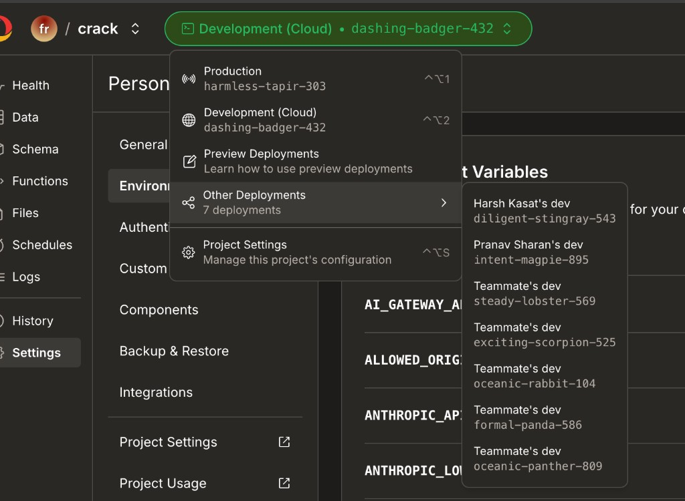
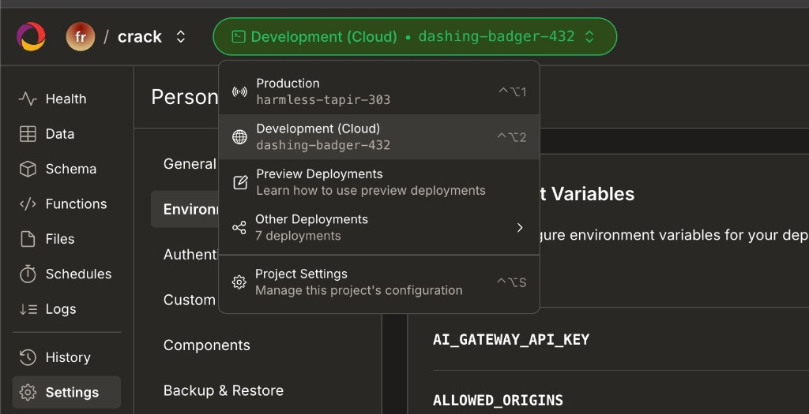
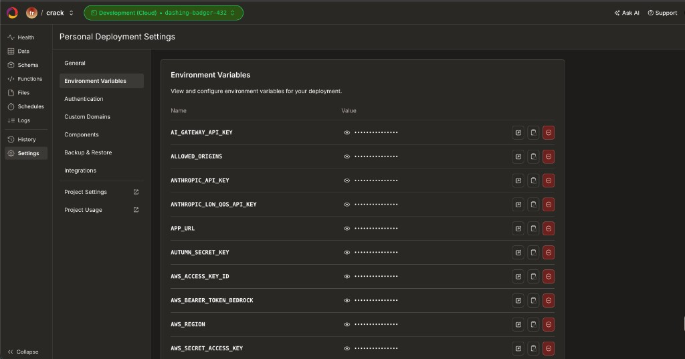
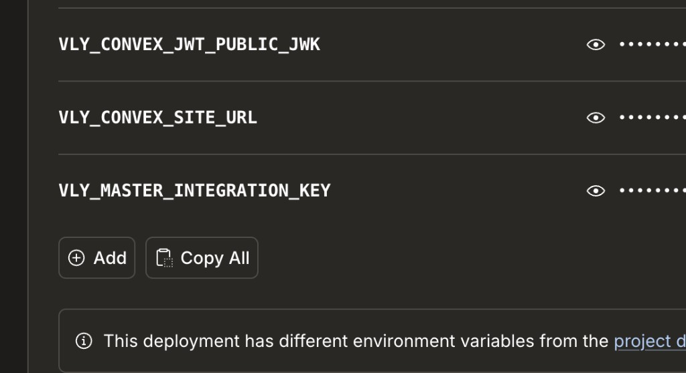
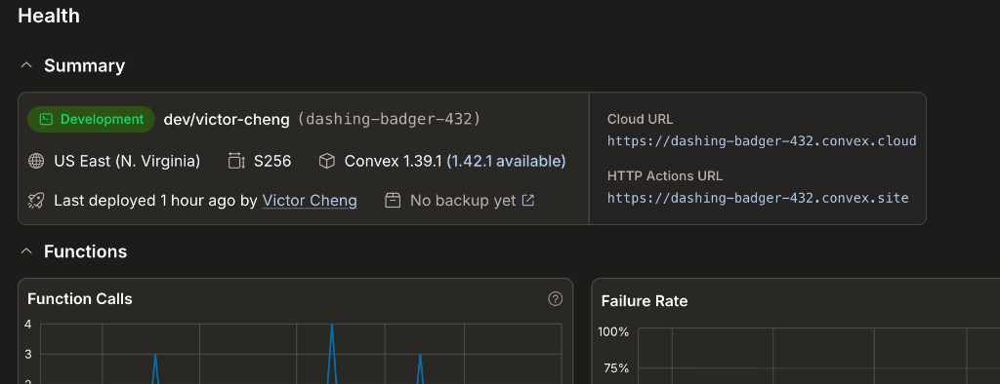
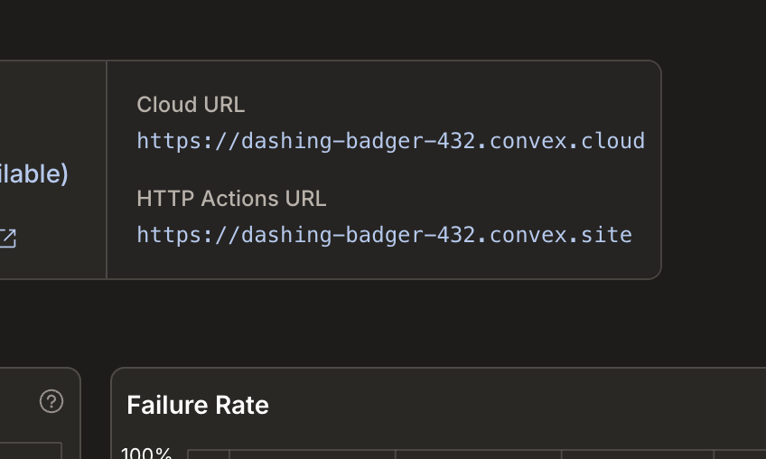
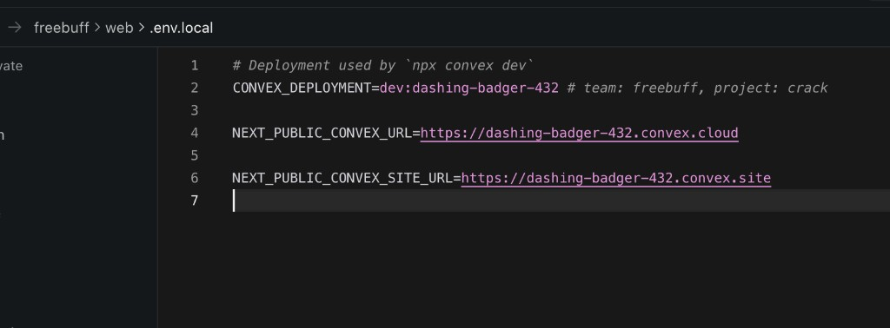
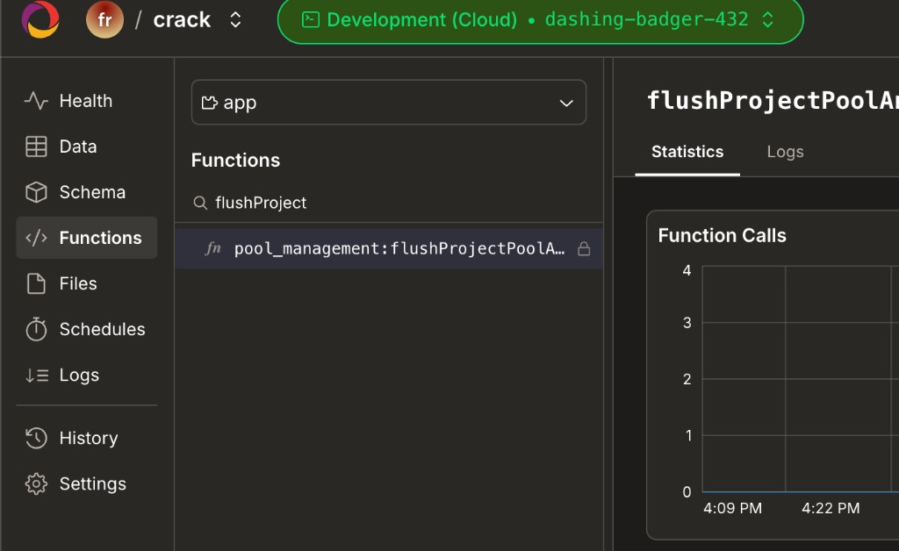
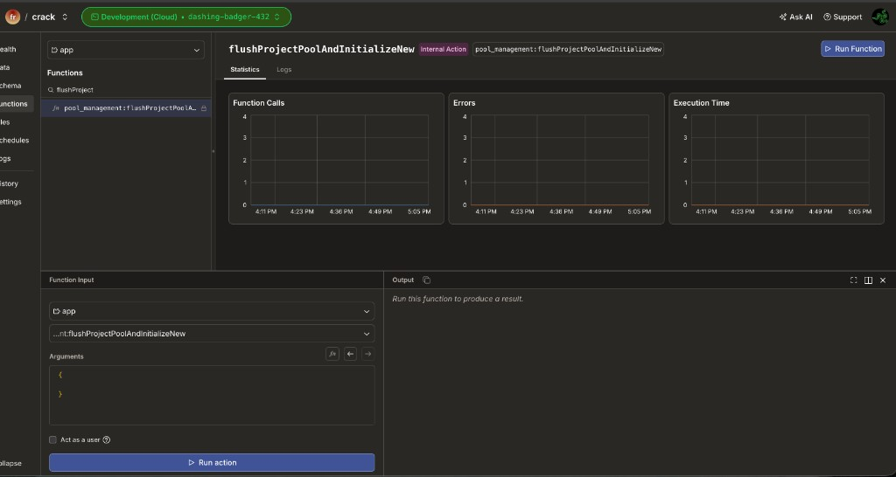

# Freebuff Web — Minimal Local Dev (Convex + Auth)

Assumes `bun`, `git`, and a GitHub account are already set up — this guide only covers Freebuff-specific secrets and Convex setup. No Cloudflare tunnel, no Docker/Postgres required.

## How auth works (why no tunnel is needed)

1. **NextAuth** signs you in on `localhost:3000` (GitHub OAuth).
2. **`/api/web/convex-token`** mints a short-lived JWT signed with `VLY_CONVEX_JWT_PRIVATE_KEY` (from Infisical).
3. **Convex** (runs in the cloud, can't reach `localhost`) validates that JWT against the public JWKS at `https://freebuff.com/api/web/.well-known/jwks.json` — production already serves the matching public key, so we point the issuer there instead of running `cloudflared`:
   ```bash
   VLY_TUNNEL_URL=https://freebuff.com
   ```

---

## Step 1 — Pull team secrets from Infisical

```bash
npm install -g @infisical/cli
infisical login          # select US region, paste browser token
infisical init            # link repo to the "freebuff" / "crack" project
bun env:pull               # syncs secrets into repo-root .env.local
```

This gives you `NEXTAUTH_SECRET`, `VLY_CONVEX_JWT_PRIVATE_KEY`, `CODEBUFF_API_KEY`, and all `NEXT_PUBLIC_*` vars. It does **not** give you a Convex dev deployment — pick one in Step 2.

---

## Step 2 — Point at a Convex dev deployment

### Option A (default, fastest): use the shared dev deployment

No dashboard steps needed. Add this to **`freebuff/web/.env.local`**:

```bash
CONVEX_DEPLOYMENT=dev:dashing-badger-432
NEXT_PUBLIC_CONVEX_URL=https://dashing-badger-432.convex.cloud
NEXT_PUBLIC_CONVEX_SITE_URL=https://dashing-badger-432.convex.site
```

This is Victor's personal dev deployment, shared for the team to develop against. It's visible in the Convex dashboard under **Other Deployments**:



Skip to [Step 3](#step-3--github-oauth--db-free-auth).

### Option B (optional): create your own separate dev deployment

Use this if you want an isolated deployment instead of sharing Victor's.

1. **Open the project** in the Convex dashboard and log in: [dashboard.convex.dev/t/freebuff/crack/harmless-tapir-303](https://dashboard.convex.dev/t/freebuff/crack/harmless-tapir-303) (that's the `crack` project's prod deployment — just used here to get you into the right project). Switch to your own **Development (Cloud)** deployment from the dropdown at the top:

   

   (If you don't have a personal dev deployment yet, run `bun --cwd freebuff/web convex dev --once` locally and log in — Convex creates one for you automatically.)

2. **Copy all env vars from Victor's dev deployment**: open [dashboard.convex.dev/t/freebuff/crack/dashing-badger-432/settings/environment-variables](https://dashboard.convex.dev/t/freebuff/crack/dashing-badger-432/settings/environment-variables) and click **Copy All**:

   
   

3. **Paste into your own deployment**: switch the dropdown to your **Development (Cloud)** deployment → **Settings** → **Environment Variables** → paste.

4. **Get your deployment's URLs** from the **Health** tab — `Cloud URL` and `HTTP Actions URL`:

   
   

5. **Update `freebuff/web/.env.local`** with your own deployment's values (replace `dashing-badger-432` with your deployment name — `Cloud URL` → `NEXT_PUBLIC_CONVEX_URL`, `HTTP Actions URL` → `NEXT_PUBLIC_CONVEX_SITE_URL`):

   ```bash
   CONVEX_DEPLOYMENT=dev:your-deployment-name
   NEXT_PUBLIC_CONVEX_URL=https://your-deployment-name.convex.cloud
   NEXT_PUBLIC_CONVEX_SITE_URL=https://your-deployment-name.convex.site
   ```

   

6. **Initialize the project pool** on your new deployment (one-time): in the dashboard, go to **Functions** → search `flushProject` → click `pool_management:flushProjectPoolAndInitializeNew` → **Run Function** → **Run action**:

   
   

---

## Step 3 — GitHub OAuth + DB-free auth

Add to **repo-root `.env.development.local`** (create if missing):

```bash
# Infisical's CONVEX_DEPLOY_KEY targets prod — clear it so the Convex CLI
# uses your logged-in dev access instead.
CONVEX_DEPLOY_KEY=

# Shared Freebuff local-dev GitHub OAuth app.
# GitHub app callback MUST be http://localhost:3000/api/auth/callback/github
FREEBUFF_GITHUB_ID=Ov23liDyVGuGQHzo1exe
FREEBUFF_GITHUB_SECRET=fb7db5102481e8918c8a60a4cd4c42f4a8eff142

# Sign in without Postgres: JWT-only sessions, no DrizzleAdapter/DB writes.
FREEBUFF_DEV_AUTH_WITHOUT_DB=true
```

---

## Step 4 — Run

```bash
VLY_TUNNEL_URL=https://freebuff.com bun dev:vly:e2e
```

Open **http://localhost:3000/web** and sign in with **Continue with GitHub** (Google uses dummy Infisical creds and won't work).

---

## Troubleshooting

| Symptom | Fix |
|---------|-----|
| `No CONVEX_DEPLOYMENT set` | Add the three Convex vars to `freebuff/web/.env.local` |
| Convex CLI pushes to prod / deploy key errors | `CONVEX_DEPLOY_KEY=` in root `.env.development.local` |
| `cloudflared is not installed` | Use `VLY_TUNNEL_URL=https://freebuff.com bun dev:vly:e2e` |
| `redirect_uri mismatch` (GitHub) | OAuth callback must be `http://localhost:3000/api/auth/callback/github`, not `3002` |
| `error=Callback` on sign-in | Set `FREEBUFF_DEV_AUTH_WITHOUT_DB=true`, restart the dev server |
| `error=OAuthCallback` (Google) | Use GitHub — Google creds are dummy in Infisical |
| `EADDRINUSE` on port 3000 | `lsof -nP -iTCP:3000 -sTCP:LISTEN` → `kill -9 <pid>` |
| `convex dev` looks frozen | Normal — it's a watch process. Use `bun dev:vly:e2e`, don't run it standalone |
| Missing `@codebuff/sdk` in Convex | `bun --cwd sdk run build` |
| Building a new project fails (R2/Daytona errors) | Expected — full project builds need prod infra, out of scope for this guide |

---

## When you need more

- **Postgres-backed auth / referrals / billing:** `bun dev:vly:e2e --with-db` (requires Docker), remove `FREEBUFF_DEV_AUTH_WITHOUT_DB`.
- **Tunnel instead of prod JWKS:** omit `VLY_TUNNEL_URL`, install `cloudflared` — see [LOCAL_DEV.md](./LOCAL_DEV.md).
- **Infisical details:** [INFISICAL_SETUP_GUIDE.md](../../INFISICAL_SETUP_GUIDE.md).
