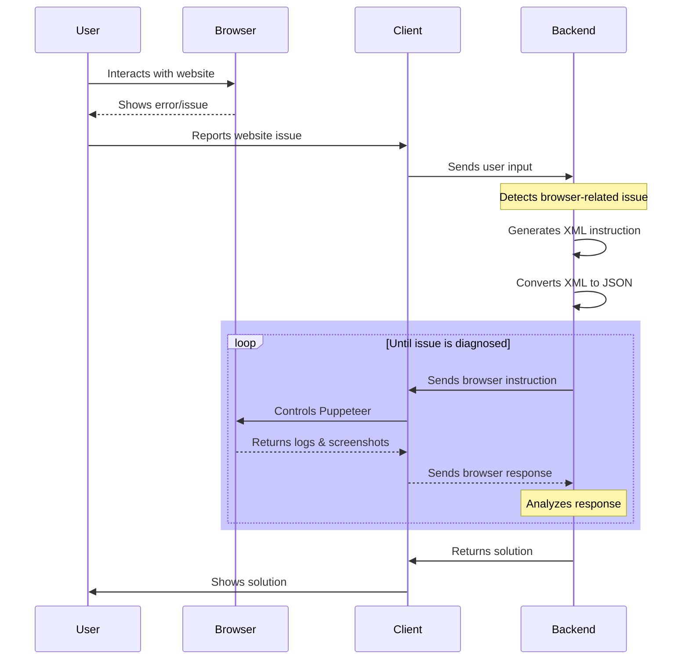

# Browser Debugging Integration Plan

## Flow Diagram



## Overview

This document outlines the architecture and implementation plan for integrating browser-based debugging capabilities into Codebuff. The system follows the flow shown in the diagram above, where the backend orchestrates browser debugging through the client's Puppeteer instance.

### Key Goals

1. **Automated Issue Detection**: Backend should identify when a user's problem requires browser investigation
2. **Minimal User Interaction**: After initial report, system should automatically gather needed information
3. **Iterative Diagnosis**: System should be able to perform multiple browser interactions to fully understand an issue
4. **Safe Browser Control**: Ensure browser instances are properly managed and cleaned up

### System Flow

1. Initial Interaction (diagram steps 1-2):
   - User encounters issue on their website (e.g., crashes, errors, unexpected behavior)
   - Browser displays error or problematic behavior
   - System captures initial context about the issue

2. Issue Reporting (diagram steps 3-4):
   - User reports issue through Codebuff CLI with website URL and issue description
   - Client formats and sends details to backend
   - Backend uses LLM to determine if browser investigation is needed

3. Diagnostic Loop (highlighted blue section):
   - Backend generates XML instructions for browser interaction
   - Instructions are converted to JSON for client consumption
   - Client executes instructions via Puppeteer
   - Browser returns:
     - Console logs
     - Network requests
     - JavaScript errors
     - Screenshots
     - Performance metrics
   - Backend analyzes data and decides next action
   - Loop continues until enough information is gathered

4. Resolution (final steps):
   - Backend processes all gathered data
   - Generates solution (code changes, configuration updates, etc.)
   - Client applies changes and shows results to user
   - Browser instance is properly cleaned up

## Architecture

### Components and Responsibilities

1. **Backend (Detection & Analysis)**
   - Corresponds to "Backend" in diagram
   - Uses LLM to analyze user requests and detect browser-related issues
   - Generates XML-based browser control instructions
   - Processes and aggregates:
     - Browser logs and errors
     - Network request data
     - Screenshots and visual evidence
     - Performance metrics
   - Makes decisions about next diagnostic steps
   - Generates solutions based on comprehensive analysis
   - Manages diagnostic session state

2. **Client (Browser Control)**
   - Corresponds to "Client" in diagram
   - Manages complete Puppeteer browser instance lifecycle:
     - Creation and initialization
     - Configuration (viewport, permissions, etc.)
     - Resource cleanup
   - Converts backend XML instructions to Puppeteer actions
   - Sets up browser event listeners and log capture
   - Handles browser crashes and restarts
   - Manages screenshot capture and compression
   - Streams results back to backend
   - Ensures proper cleanup on completion or error

3. **Browser Integration**
   - Corresponds to "Browser" in diagram
   - Controlled via Puppeteer
   - Captures comprehensive diagnostic data:
     - Console output (log, warn, error)
     - Network requests and responses
     - JavaScript errors and stack traces
     - Resource timing data
     - Memory usage metrics
   - Provides interface for automated interaction
   - Maintains isolation from user's regular browsing

4. **Communication Protocol**
   - Shown as arrows in diagram
   - Structured message flow:
     - Backend generates XML instructions
     - XML converted to JSON for client consumption
     - Client sends structured response data
   - WebSocket-based real-time communication
   - Binary data handling for screenshots
   - Error reporting and recovery mechanisms
   - Session management and cleanup signals

## Implementation Details

### 1. XML Instruction Format
Corresponds to "Generates XML instruction" in diagram:

```xml
<browser_action action="start" url="https://example.com" headless="true" timeout="30000" />

<browser_action action="click" selector="#submit-button" waitForNavigation="true" />

<browser_action action="screenshot" fullPage="true" quality="80" />

<browser_action action="type" selector="#search-input" text="search query" delay="100" />

<browser_action action="navigate" url="https://example.com/page2" waitUntil="networkidle0" />

<browser_action action="stop" />
```

This format:
- Uses attributes instead of nested elements
- Matches Codebuff's existing XML patterns
- Simplifies parsing and generation
- Makes instructions more concise

### 2. JSON Message Types with Zod Schemas
Corresponds to "Converts XML to JSON" in diagram:

```typescript
import { z } from 'zod'

// Browser Action Schemas
const BrowserStartActionSchema = z.object({
  type: z.literal('start'),
  url: z.string().url(),
  options: z
    .object({
      headless: z.boolean().default(true),
      timeout: z.number().min(0).max(30000).default(10000),
    })
    .optional(),
})

const BrowserNavigateActionSchema = z.object({
  type: z.literal('navigate'),
  url: z.string().url(),
  options: z
    .object({
      waitUntil: z
        .enum(['load', 'domcontentloaded', 'networkidle0'])
        .default('networkidle0'),
      timeout: z.number().min(0).max(30000).default(10000),
    })
    .optional(),
})

const BrowserClickActionSchema = z.object({
  type: z.literal('click'),
  selector: z.string(),
  options: z
    .object({
      waitForNavigation: z.boolean().default(false),
      button: z.enum(['left', 'right', 'middle']).default('left'),
    })
    .optional(),
})

const BrowserTypeActionSchema = z.object({
  type: z.literal('type'),
  selector: z.string(),
  text: z.string(),
  options: z
    .object({
      delay: z.number().min(0).default(100),
    })
    .optional(),
})

const BrowserScreenshotActionSchema = z.object({
  type: z.literal('screenshot'),
  options: z
    .object({
      fullPage: z.boolean().default(false),
      quality: z.number().min(0).max(100).default(80),
    })
    .optional(),
})

const BrowserStopActionSchema = z.object({
  type: z.literal('stop'),
})

// Combined Action Schema
const BrowserActionSchema = z.discriminatedUnion('type', [
  BrowserStartActionSchema,
  BrowserNavigateActionSchema,
  BrowserClickActionSchema,
  BrowserTypeActionSchema,
  BrowserScreenshotActionSchema,
  BrowserStopActionSchema,
])

// Browser Instruction Schema
const BrowserInstructionSchema = z.object({
  type: z.literal('browser-instruction'),
  action: BrowserActionSchema,
})

// Browser Log Schema
const BrowserLogSchema = z.object({
  type: z.enum(['error', 'warning', 'info']),
  message: z.string(),
  timestamp: z.number(),
  location: z.string().optional(),
  stack: z.string().optional(),
})

// Browser Response Schema
const BrowserResponseSchema = z.object({
  type: z.literal('browser-response'),
  data: z.object({
    success: z.boolean(),
    screenshot: z.string().optional(), // Base64 encoded
    logs: z.array(BrowserLogSchema),
    error: z.string().optional(),
    metrics: z
      .object({
        loadTime: z.number(),
        memoryUsage: z.number(),
        jsErrors: z.number(),
      })
      .optional(),
  }),
})

// Infer TypeScript types from schemas
type BrowserAction = z.infer<typeof BrowserActionSchema>
type BrowserInstruction = z.infer<typeof BrowserInstructionSchema>
type BrowserResponse = z.infer<typeof BrowserResponseSchema>
```

### 3. Flow Sequence
Maps directly to diagram phases:

1. **Issue Detection (Backend)**
   - Corresponds to "Detects browser-related issue" note
   - Backend determines if this is a browser issue, based on LLM

2. **XML Instruction Generation (Backend)**
   - Corresponds to "Generates XML instruction" step
   ```typescript
   function generateBrowserInstruction(action: string, params: Record<string, string | number | boolean>): string {
     const attributes = Object.entries({
       action,
       ...params
     })
       .map(([key, value]) => `${key}="${value}"`)
       .join(' ')
     
     return `<browser_action ${attributes} />`
   }
   ```

3. **XML to JSON Conversion (Backend)**
   - Corresponds to "Converts XML to JSON" step
   ```typescript
   function convertXmlToJson(xml: string): BrowserInstruction {
     // First convert XML to raw JSON
     const rawJson = parseXmlToJson(xml)
     
     // Validate against schema
     const result = BrowserInstructionSchema.safeParse(rawJson)
     if (!result.success) {
       const issues = result.error.issues.map(i => ({
         field: i.path.join('.') || null,
         error: i.message,
       }))
       throw new Error(`Invalid browser instruction: ${JSON.stringify(issues)}`)
     }
     
     return result.data
   }
   ```

This ensures:
- All instructions are validated against the Zod schema
- Type safety is maintained
- Runtime validation catches malformed instructions
- Detailed error messages for debugging

4. **Client Execution**
   - Corresponds to "Controls Puppeteer" step
   ```typescript
   class BrowserManager {
     async executeInstruction(instruction: BrowserAction) {
       switch (instruction.action.type) {
         case 'start':
           await this.startBrowser(instruction.action.options)
           break
         case 'navigate':
           await this.page?.goto(instruction.action.url!)
           break
         // ... other actions
       }
     }
   }
   ```

5. **Response Processing (Backend)**
   - Corresponds to "Analyzes response" note
   ```typescript
   function analyzeBrowserResponse(response: BrowserResponse) {
     // Analyze logs and screenshots
     // Determine next action
     // Generate more instructions if needed
   }
   ```

### 4. Tool Handler Integration
Part of the diagnostic loop in diagram:

```typescript
const browserToolHandler: ToolHandler = async (
  instruction: BrowserInstruction,
  id: string
) => {
  const manager = await getBrowserManager()
  const result = await manager.executeInstruction(instruction)
  return formatBrowserResult(result)
}
```

## Implementation Phases
Aligned with diagram flow:

### Phase 1: XML Communication
Maps to backend instruction generation:
1. Implement XML instruction generation in backend
2. Create XML to JSON conversion utilities
3. Add browser instruction schemas
4. Update WebSocket protocol

### Phase 2: Browser Control
Maps to client-browser interaction:
1. Implement BrowserManager in npm-app
2. Add browser tool handler
3. Create browser action executors
4. Add response formatting

### Phase 3: Analysis & Flow Control
Maps to diagnostic loop:
1. Implement browser issue detection
2. Add response analysis
3. Create instruction generation logic
4. Build flow control system

### Phase 4: Advanced Features
Enhances overall flow:
1. Add error recovery
2. Implement timeout handling
3. Add resource cleanup
4. Create debugging utilities

## Error Handling
Covers error cases in diagram flow:

1. **XML Parsing**
   - Handle errors in backend instruction generation
   - Validate XML structure
   - Handle malformed instructions
   - Provide clear error messages

2. **Browser Control**
   - Handle errors in client-browser interaction
   - Handle navigation timeouts
   - Manage connection errors
   - Clean up resources on failure

3. **Flow Control**
   - Handle errors in diagnostic loop
   - Handle interrupted sequences
   - Implement retry logic
   - Maintain state consistency

## Security Considerations
Applied throughout the flow:

1. **Input Validation**
   - Validate user input at client
   - Sanitize XML content
   - Validate URLs and selectors
   - Check for injection attempts

2. **Resource Protection**
   - Protect browser resources
   - Limit browser instances
   - Control memory usage
   - Restrict file system access

3. **Communication Security**
   - Secure all diagram communication paths
   - Validate message formats
   - Protect sensitive data
   - Implement timeouts

## Testing Strategy
Tests each part of the flow:

1. **XML Processing**
   - Test backend instruction generation
   - Test instruction generation
   - Verify conversion accuracy
   - Check error handling

2. **Browser Control**
   - Test client-browser interaction
   - Test action execution
   - Verify response handling
   - Check resource cleanup

3. **Integration Tests**
   - Test complete flow
   - Full flow testing
   - Error recovery
   - Performance monitoring

## Dependencies
Required for each component:

- Puppeteer for browser control
- XML parsing utilities
- WebSocket communication
- Screenshot handling

## Monitoring & Logging
Tracks each step in diagram:

1. **Instruction Tracking**
   - Monitor backend instruction generation
   - Log generated XML
   - Track conversion success
   - Monitor execution flow

2. **Performance Metrics**
   - Monitor diagnostic loop performance
   - Action execution time
   - Resource usage
   - Error rates

3. **Debug Information**
   - Track all diagram components
   - Browser logs
   - Network activity
   - Error traces

## Documentation

1. **XML Format**
   - Document backend instruction format
   - Instruction structure
   - Available actions
   - Parameter formats

2. **Integration Guide**
   - Document complete flow
   - Setup requirements
   - Message flow
   - Error handling

3. **Troubleshooting**
   - Cover all diagram components
   - Common issues
   - Debug procedures
   - Recovery steps
